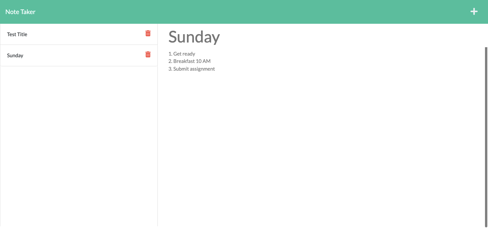

<h1 align="center">:memo: Note Taker :memo:</h1>

<p align="center">
    
    
    
    
</p>

## Deployed Links
:heroku: [Heroku App](https://ha-note-taker.herokuapp.com/)

:octocat: [GitHub Repo](https://github.com/nguyendinhkhanhha296/note-taker)

## :bookmark: Table of Contents
* [Tools](#tools)
* [Description](#description)
* [Instructions](#instructions)
* [Demo](#demo)

## :hammer: Tools
* [Express.js](https://expressjs.com/)
* [Jest](https://jestjs.io/en/)
* [Heroku](https://devcenter.heroku.com/start)
* [Insomnia](https://support.insomnia.rest/)
* [JSON](https://www.json.org/json-en.html)
* [Node.js](https://nodejs.org/en/)

## :bulb: Description
        🔍This application will use an Express.js back-end and will save and retrieve data from a JSON file. 
          
```
GIVEN a note-taking application
WHEN I open the Note Taker
THEN I am presented with a landing page with a link to a notes page
WHEN I click on the link to the notes page
THEN I am presented with a page with existing notes listed in the left-hand column, plus empty fields to enter a new note title and the note’s text in the right-hand column
WHEN I enter a new note title and the note’s text
THEN a Save icon appears in the navigation at the top of the page
WHEN I click on the Save icon
THEN the new note I have entered is saved and appears in the left-hand column with the other existing notes
WHEN I click on an existing note in the list in the left-hand column
THEN that note appears in the right-hand column
WHEN I click on the Write icon in the navigation at the top of the page
THEN I am presented with empty fields to enter a new note title and the note’s text in the right-hand column
```

## Instructions
* Install [Express.js](https://expressjs.com/) by running the command `npm init -y` and `npm i express`. 

* Download [Heroku CLI](https://devcenter.heroku.com/articles/heroku-cli).
* To create a new Heroku application , enter the command `heroku create <app-name>` into the terminal.

## Demo
